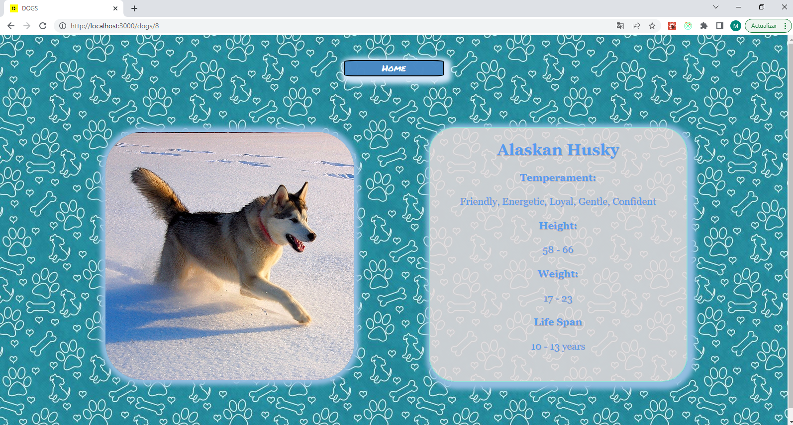

# Individual Project - Dogs

  

Se trata de una aplicación que consume datos de una API de perros y de una base de datos local. Cuenta con una página inicial desde la cual se accede a la página principal, donde se muestran todos los perros. 
La aplicación te permite buscar por nombre, filtrar por temperamentos, raza y ordenar por orden alfabético y por peso.  También tiene un paginado. 
Accediendo a cada perro, se muestra más información y un link que te redirecciona a la página oficial.
También da la posibilidad al usuario de crear un perro propio a través de un formulario controlado.
 
Tecnologías utilizadas: 
Javascript | React | Redux | CSS | Node | Express | Sequelize | PostgreSQL 

     
  
     
  
     
  
     

